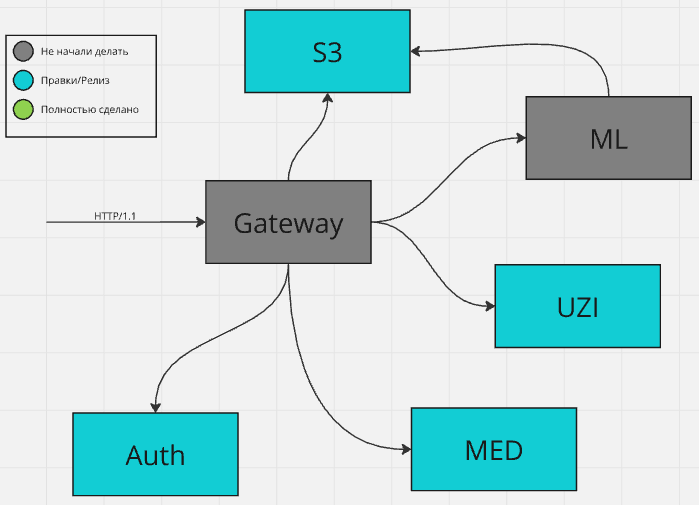

#### 🌈MED-ML BACKEND

## Архитектура


+ Основа любого сервиса - *слоистая архитектура*. Везде где можно следуем *clean architecrute*, с некоторыми исключениями. [^1]
+ Для БД везде используется [gorm](https://gorm.io/)
+ Все ручки пишутся через `grpc` с генерацией `http` и `swagger`


[^1]: DTO структуры пишутся и используются всеми слоями сразу, так как кодовая база микросервиса не должна быть большой.

## Requirements
+ go 1.23.0
+ protoc: [protoc](https://github.com/protocolbuffers/protobuf)
+ postgres
+ protoc-gen-go: `go install google.golang.org/protobuf/cmd/protoc-gen-go@latest`
+ protoc-gen-go-grpc: `go install google.golang.org/grpc/cmd/protoc-gen-go-grpc@latest`
+ protoc-gen-grpc-gateway `go install github.com/grpc-ecosystem/grpc-gateway/v2/protoc-gen-grpc-gateway@latest`
+ googleapis proto: `git clone https://github.com/googleapis/googleapis.git`
+ grpc-gateway: `https://github.com/grpc-ecosystem/grpc-gateway.git`
+ taskfile: `go install github.com/go-task/task/v3/cmd/task@latest`

## Запуск и сборка

# Docker
*panic("not implemented")*

# Без Docker
В корне `task generate` - сгенерит `grpc`, `http` ручки и `swagger`.
В корне каждого микросервиса напишите `task run` - поднимит сервер в соответствии с конфигом. Env выставляются через taskfile.

## Правила разработки

# `.proto` файлы

Устанавливаем *protoc* и *go* плагины для него.

+ *protoc-gen-go* - намутит нам `go` файлики
+ *protoc-gen-go-grpc* - оформит сочный `grpc`
+ *protoc-gen-grpc-gateway* - накрафтит крутейшие `http` ручки
+ *protoc-gen-openapiv2* - насуетит разрывной `swagger`

Что бы сделать `http` ручки из `grpc` ручек, дописываем option:
```
service Auth {
    rpc Login (LoginRequest) returns (LoginResponse) {
        option (google.api.http) = {
            post: "/v0/auth/login"
            body: "*"
        };
    }
}
```
**\*** здесь указывает на преобразование входяшего `.json` в прото структуру в соответствии с именами полей.

Как это работает смотрите тут: [gooooogle](https://cloud.google.com/endpoints/docs/grpc/transcoding)

Для документации `swagger`'а пишим комметарии в `.proto`. Верхний комментарий будет принят как **summary***(краткое описание)*, нижний как **description***(полное)*.

При явном указании, документация swagger будет правильная.

```
...
    // Получение JWT AS + RT. <--- это summary
    //
    // Получает почту и пароль. При вверных данных вернет пару access + refresh JWT токенов. <--- а это description
    rpc Login (LoginRequest) returns (LoginResponse) 
        ...
...
```

Указывайте имена полей json тегами `[json_name = "device_id"]`; в ином случае поля из протой пойдут как `camelCase`, вместо `snake_case`
```
message CreateGroupMetaDataRequest {
    int64 device_id = 1 [json_name = "device_id"];
    string projection = 2;
    string card_uuid = 3 [json_name = "card_id"];
}
```

package в `.proto`: `option go_package = "yir/auth/api/v0/auth;auth";`

Здесь:
+ yir <- дир проекта
+ med <- дир микросервиса
+ api <- дир апи
+ v0 <- дир версии api
+ med <- дир сервиса *(их может быть много, это нормально)*

# Правила написания кода
+ Весь код обязан быть отформатирован через **go fmt**: `go fmt ./...`
+ Весь код обязан быть отформатирован через **goimports**: `goimports -w .`
*Прописано в task build*
+ Если логируете приватные данные, делать это только через **Debug**.
+ Логировать в едином стиле:
    + Запросы в `repository` слой через *Request/Reponse*: *log.Info("[Requset] Do smt...", zap.(...) ...Fields.)*
    + *Будет дополняться*


## Кто что сделал?

+ *Gateway* - nil
+ *Auth* - Захар
+ *Rabbit/Kafka* - nil
+ *Med*
    * *Patient* - Мага
    * *Мед-Воркера* - Вова
    * *Карты* - nil
+ *Uzi* - Захар
+ *ML-service* - nil `Python`
+ *S3 upload* - nil


