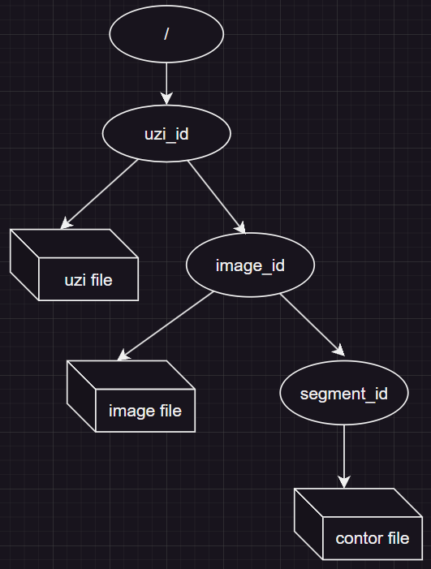

## S3-UPLOAD

# Для чего?

Здесь будут храниться файлы uzi, а именно

+ tiff/png файл всего узи
+ каждая png из tiff по отдельности
+ контуры узлов

# Что делает?

Загружает файлы, возвращает их id-шники

