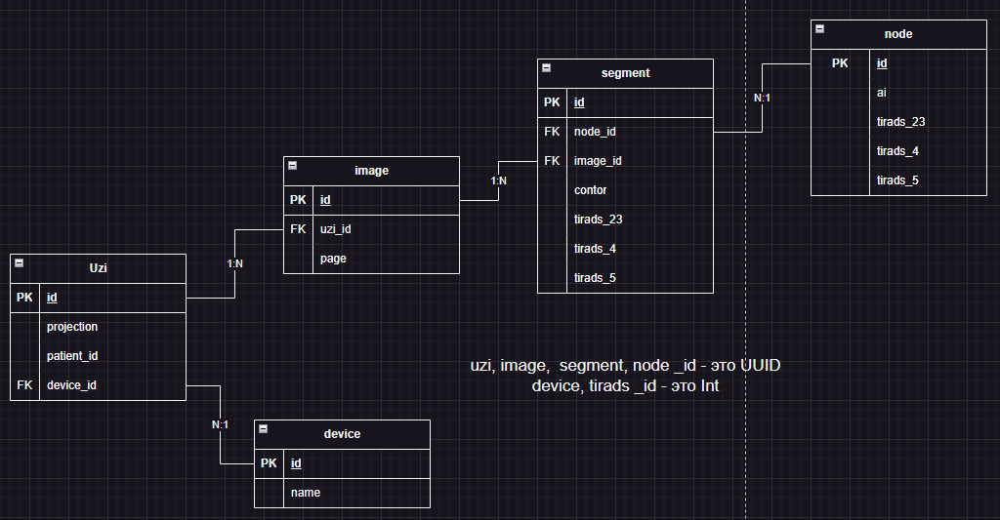

# Uzi service

цель сервиса - хранение отношений между узлами сегментами картинками в узи. Также сервис ответственнен за разбиение узи на подкартинки

## Reqire
_лучше подгружать через `.env`_
| Env | Value | Описание |
|----------|----------|----------|
|GOOSE_DRIVER| postgres | `env` для миграций |
|GOOSE_DBSTRING| postgres dsn  | dsn postres sql для миграций |
|DB_DSN| postgres dsn | dsn для postgres sql |
|APP_URL| localhost:50055 | grpc url |
|S3_ENDPOINT| localhost:9000 | s3 addrs |
|S3_TOKEN_ACCESS| key | pub ключ для S3 |
|S3_TOKEN_SECRET| secret key | priv ключ для S3 |
|BROKER_ADDRS| localhost:19092 | url для брокера (массив) |

## Сущности

Представлены на картинке: 
